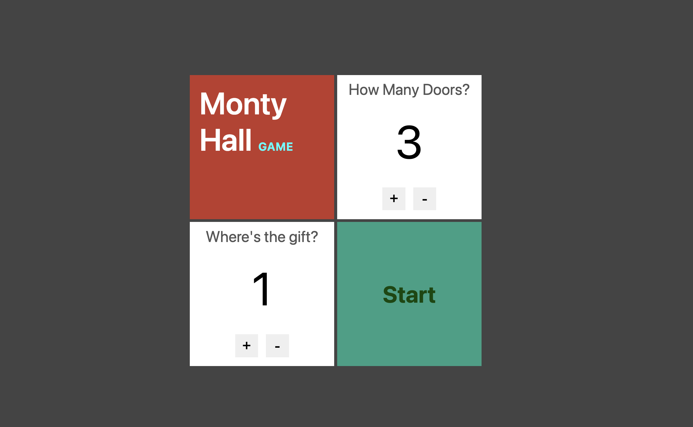
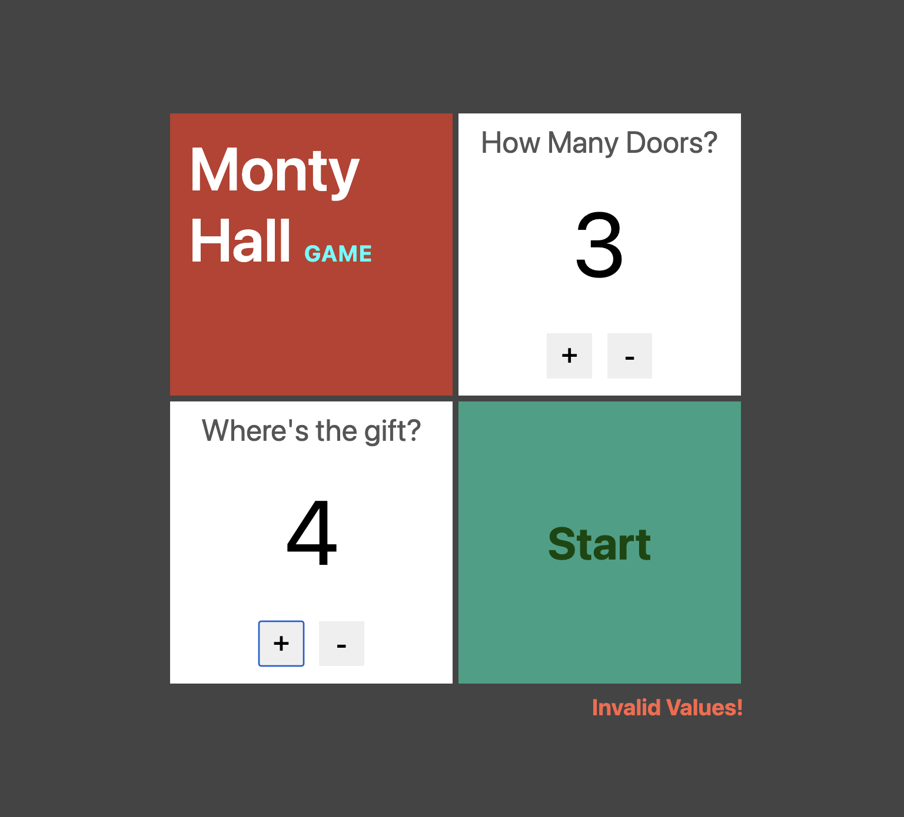
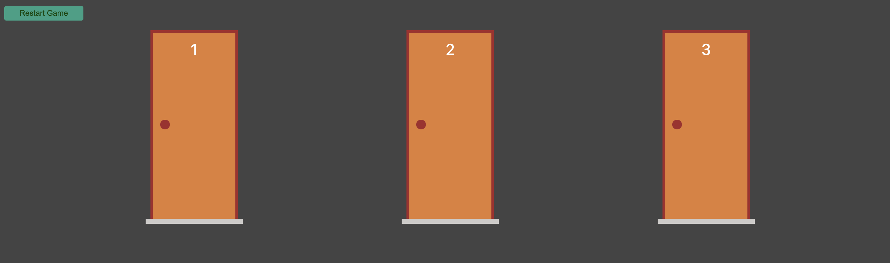
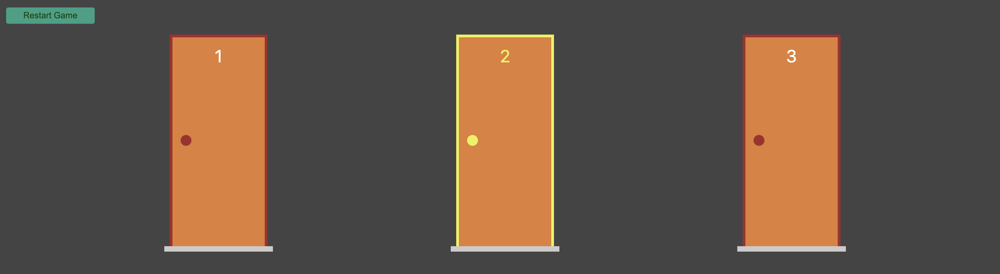
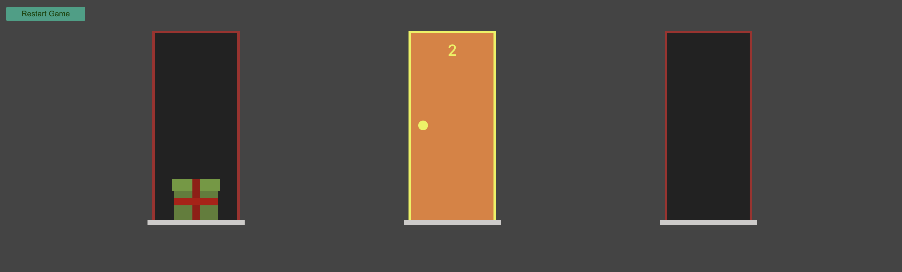

# Monty Hall Problem

The Monty Hall Problem gets its name from the TV game show, Let's Make A Deal hosted by Monty Hall. The scenario is such: you are allowed to select one closed door of three, behind one of which there is a prize. The other two doors hide "goats" (or some other such "non-prize") or nothing at all. Once you have selected, Monty Hall will open one of the remaining doors, revealing that it does not contain the prize. He then asks if you would like to switch your selection to the other unopened door or stay with your original choice. Here is the problem:

## Does it matter if you switch?

Yes, switching the door increases your probability of winning.

## Code

#### 1. Build the code

``` bash
    npm run build
```

#### 2. Start the server
``` bash
    npm run start
```
#### 3. Open the server

```chrome
    http://localhost:3000/

```


### Start the game


### Insert invalid values


### The doors are displayed


### One door is marked


### Another door is opened


